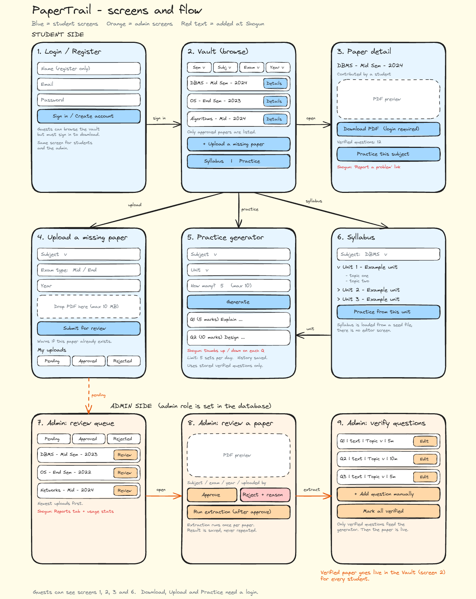

# PaperTrails

> Students in my college and branch hunt for past exam papers and the syllabus across WhatsApp groups and scattered Drive folders, and have nothing to practise with that matches how their exams are actually set.

---

## The Idea

Every exam season, students in my college and branch chase seniors and group chats for old question papers, and even when they find them they only get old questions to read. PaperTrails is one login-protected place to download every approved past paper and see the syllabus, where students can upload papers that are missing and an admin approves them. Each approved paper is read once by an AI, checked by a human, and stored, so the app can generate fresh practice questions in the style of our real past papers for any syllabus unit, without reading PDFs whenever a student clicks. Because it works only from verified papers of one specific college and branch, the practice questions are specific to these exams instead of generic chatbot output. (Scoped to one college and branch for now — see "What I'm Building Toward" below for how this could expand later.)

---

## Sketch

[View live board](https://excalidraw.com/#json=9EFw36O0st3QnS3e4Vxbz,_MpbJ_eJ65kmkzlTSNqf0g)

---

## Documents

- [Product Requirements](./docs/PRD.md)
- [Architecture](./docs/ARCHITECTURE.md)
- [API Spec](./docs/API_SPEC.md)
- [Roadmap](./docs/ROADMAP.md)
- [Requirements](./docs/REQUIREMENTS.md)

---

## Planned Stack

| Layer | Technology | Why |
|---|---|---|
| Framework | React (Vite) + React Router + Tailwind CSS | Component-based UI suits repeated cards, lists and forms, and React has the largest tutorial base |
| Backend | Node.js + Express | Same language as the frontend and an easy request/response model to debug |
| Database | PostgreSQL on Supabase (`pg` library) | The data is relational: subjects, units, topics, papers, questions, roles |
| File storage | Supabase Storage (private bucket) | The API server's disk is wiped on restart, so PDFs need real storage that can be gated behind login |
| Auth | Own email + password login: bcrypt + JWT in Express | Teaches the full login flow and gives direct control of the student and admin roles |
| AI | Google Gemini API (Flash-tier model) | One API reads a PDF for extraction and also generates questions, with a no-card free tier |
| Hosting | Vercel (frontend), Render (backend), Supabase (data and files) | All deploy from GitHub for free and give live links for frontend and backend |

---

## What I'm Building Toward

**Kenshi (frontend):** A React app with every screen of the product, running on fake data with no backend: login and register, the vault with filters for semester, subject, exam type and year, a paper page, the syllabus viewer, an upload form with a "My uploads" status list, the practice generator with a saved history, and the admin screens for reviewing papers, running extraction and verifying questions. It works on a phone-sized screen, has loading, empty and error states, and a clean folder structure. Alongside the code I collect at least 10 real papers and the syllabus for 3 subjects.

**Samurai (full-stack):** Everything becomes real. There is a PostgreSQL database seeded with the syllabus, real login with student and admin roles, PDF upload to private storage, an admin approval queue, downloads that only work when logged in, and the AI layer: admin-triggered extraction, question verification, and a practice generator that uses only verified stored questions with a daily limit per user. The frontend is live on Vercel and the backend on Render, with environment-variable setup instructions and the endpoint list documented. If time gets tight, the paper library is protected first and the AI features shrink, never the reverse.

**Shogun (production):** At least 25 real students from my college and branch have registered, and I can prove it with a screenshot of the database. They can rate generated questions, report bad papers, see which topics repeat most, and I have at least 25 feedback responses collected through a form. I write up what the feedback said and which visible improvements I made because of it, and report the success metrics from the PRD honestly. If everything is stable, I may try AI-suggested solutions clearly labelled as unverified.

**Beyond the program:** the product is deliberately scoped to one college and branch for these four weeks, since that's where I can get real papers and real users. If it works, the natural next step is letting a student pick their college and branch at signup and mapping their account to that scope — not something I'm building now, just the direction this could grow in.
